# 🏎️ GRID — Formula Racing Explorer

> An independent full-stack Formula Racing explorer built with React, Vite, Node.js, Express and SQLite.


---
# 🖥️ Application Preview

## 🏠 Home

The landing page provides an overview of the current Formula Racing season and provides quick access to the major sections of the application.

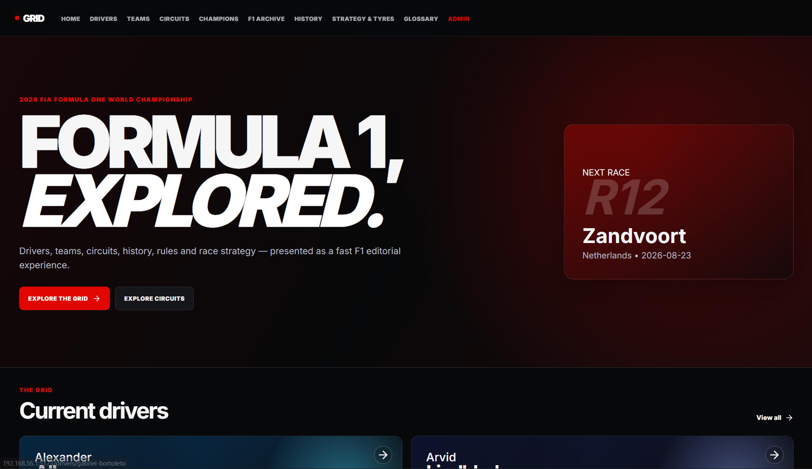

---

## 👨‍🏎️ Current Drivers

The Drivers section provides searchable current-driver information with interactive driver cards and detailed profiles.

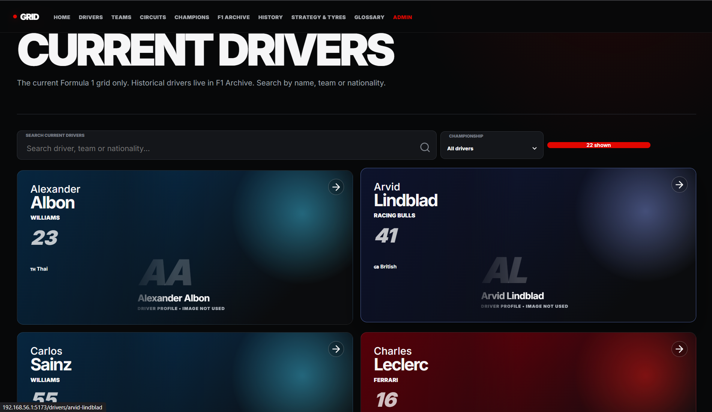

---

## 🏢 Teams

The Teams section presents current constructors with driver lineups, power-unit information, championship records and team details.

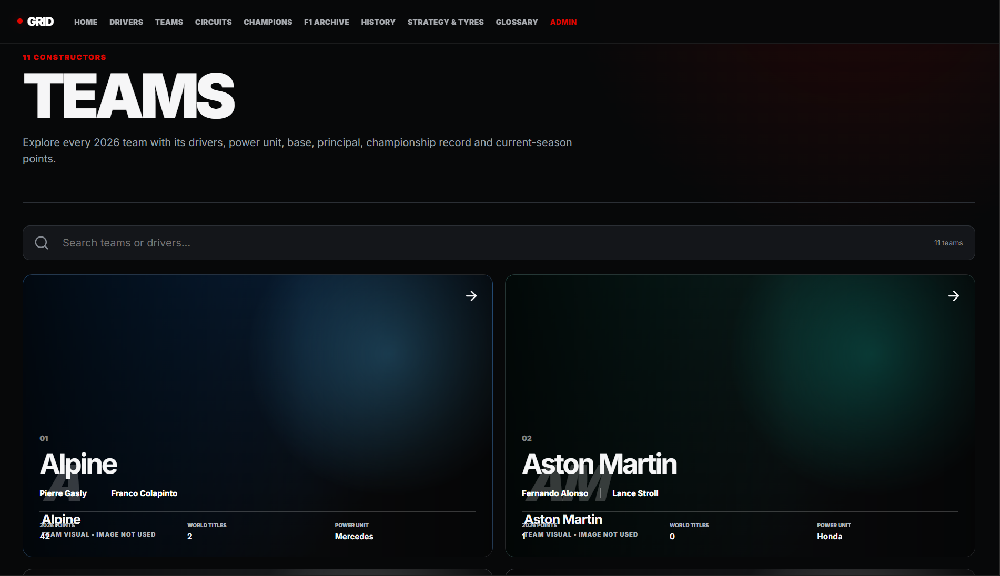

---

## 🏁 Circuits

Circuit pages provide structured circuit information including location, distance, laps, turns, records and circuit-specific guidance.

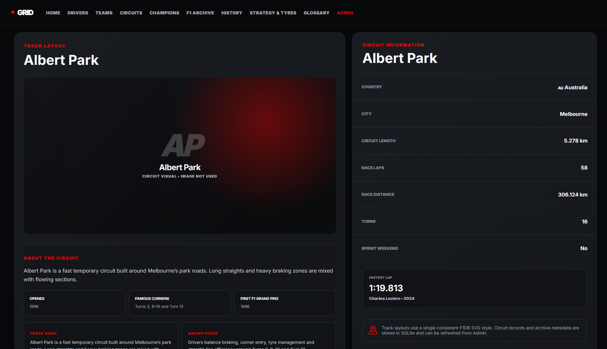

---

## 🏆 Championships

The Championships section presents World Drivers' and Constructors' Championship history chronologically.

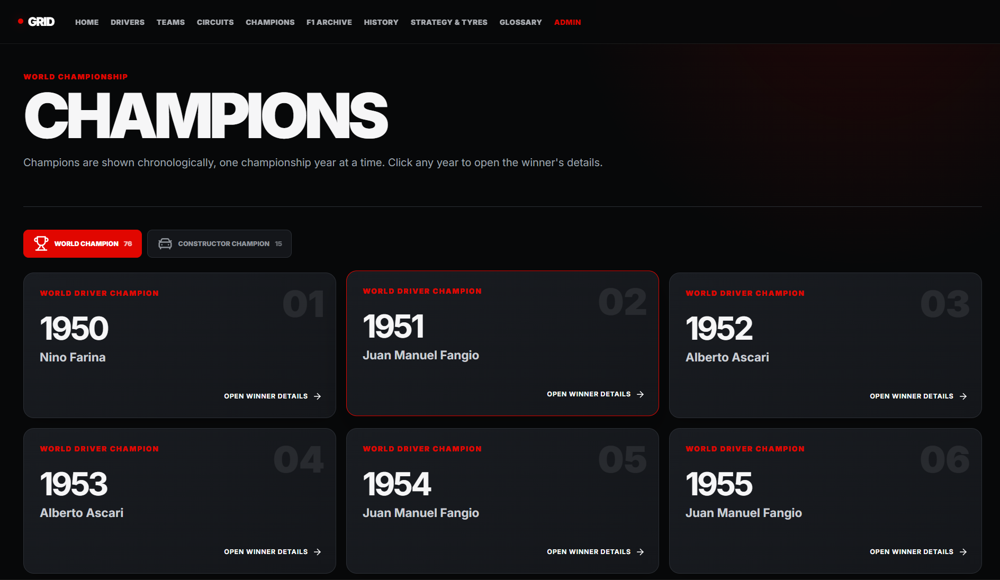

---

## 🗄️ F1 Archive

The archive separates historical drivers, constructors and circuits from the current grid.

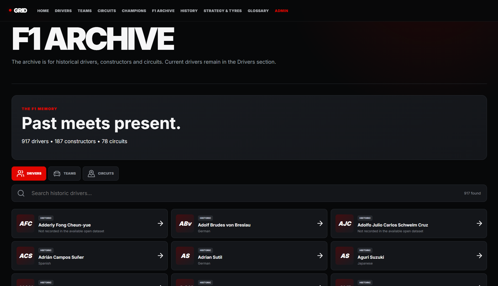

---

## 📜 F1 History

The History section presents important Formula Racing milestones through an interactive timeline.

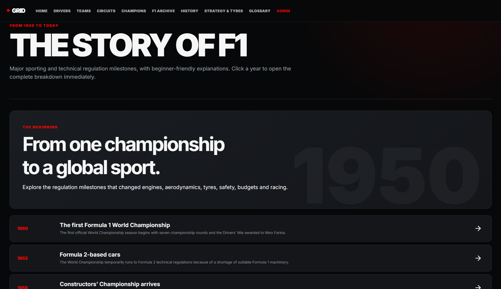

---

## 🛞 Strategy & Tyres

The Strategy & Tyres section explains tyre types, compounds and race strategies in a beginner-friendly format.

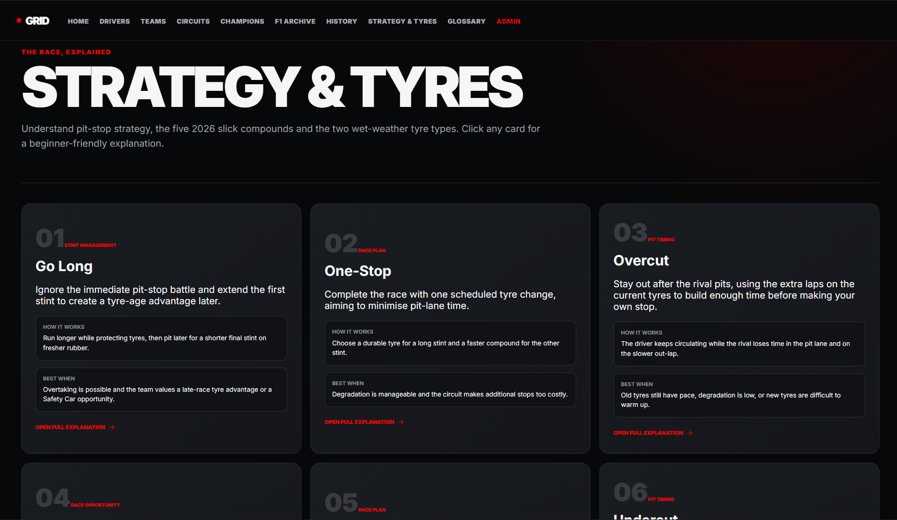

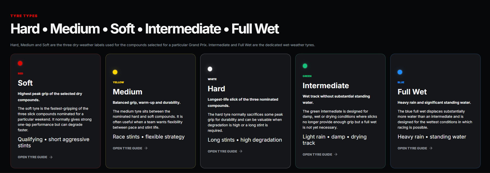

---

## 📖 F1 Glossary

The glossary provides searchable explanations of Formula Racing terminology with interactive detail panels.

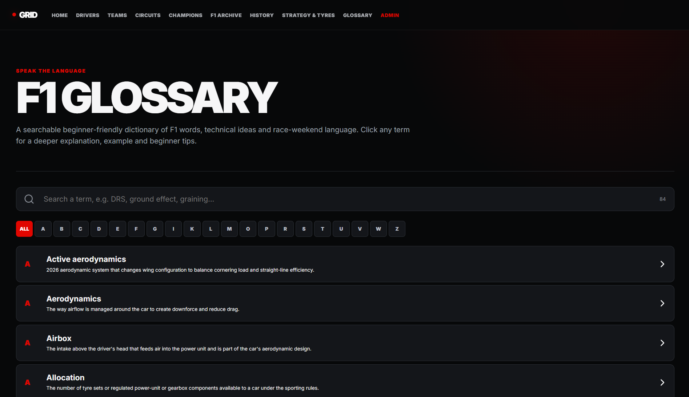

---

## 🔐 Admin Dashboard

The administrative interface provides protected database-backed content management, synchronization controls and record editing.

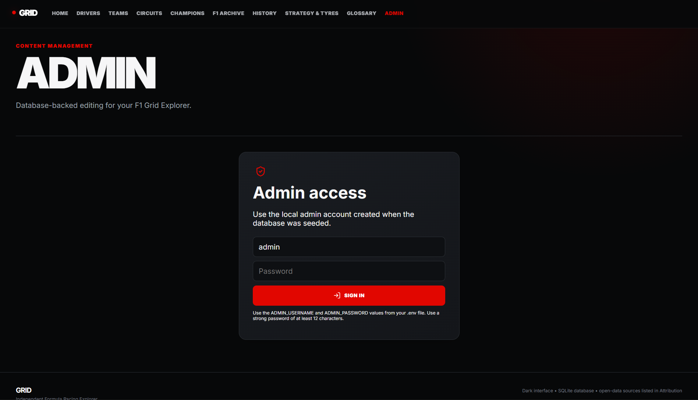

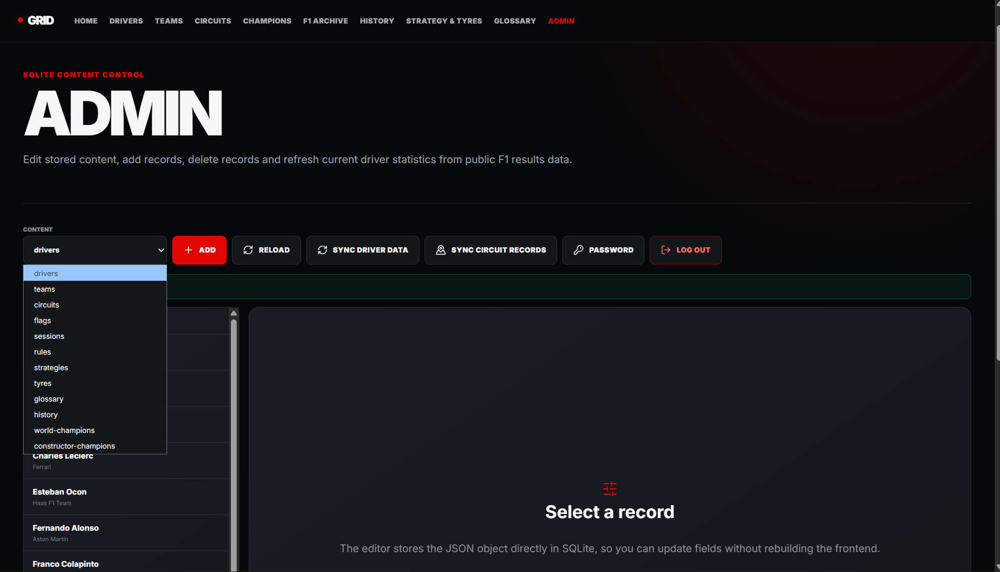.

## 📌 Overview

**GRID — Formula Racing Explorer** is an independent full-stack web application created as a software engineering portfolio project.

The application brings together current and historical Formula Racing information into an interactive interface covering:

- Drivers
- Teams / Constructors
- Circuits
- Championships
- F1 History
- F1 Archive
- Racing terminology
- Tyres
- Strategy
- Flags
- Sessions
- Rules
- Historical archives
- Administrative data management

The project was built to demonstrate practical experience with:

- Frontend development
- Backend development
- Database design
- REST API development
- Authentication
- Data processing
- Data synchronization
- Search and filtering
- Interactive UI/UX
- Historical data management

> **GRID is an independent educational and portfolio project. It is not affiliated with, endorsed by, sponsored by, or operated by Formula 1, the FIA, or any Formula 1 team.**

---

# ✨ Features

## 👨‍🏎️ Drivers

The Drivers section focuses on current Formula Racing drivers.

Driver profiles can include:

- Driver name
- Nationality
- Driver number
- Team
- Date of birth
- F1 debut
- Race wins
- Podiums
- Pole positions
- Championships
- Career statistics
- Other available driver information

### 🔎 Driver Search

The application provides interactive search suggestions while typing.

Users can:

- Search for drivers
- Search for teams
- Search for circuits
- View matching suggestions
- Select a suggestion
- Open the corresponding detail page

---

# 🏢 Teams

Team and constructor profiles provide structured information about racing teams.

Available information can include:

- Team name
- Nationality
- Team details
- Championship information
- Race wins
- Historical participation
- Other available statistics

Team information is retrieved through the application's backend and database.

---

# 🏁 Circuits

The Circuits section provides structured information about Formula Racing circuits.

Circuit profiles can include:

- Circuit name
- Country
- City
- Circuit length
- Number of turns
- Number of race laps
- Race distance
- Circuit history
- Famous corners
- Circuit description
- Fastest race lap
- Record holder
- Record year

The project intentionally does **not** use circuit photographs or circuit-layout graphics.

Circuit profiles instead use an original typography-based visual presentation that matches the overall interface.

---

# 🗄️ F1 Archive

The F1 Archive provides historical Formula Racing information.

The archive includes:

- Historical drivers
- Historical teams / constructors
- Historical circuits

## Historical Drivers

Available information can include:

- Full name
- Nationality
- Date of birth
- F1 debut / first recorded season
- Driver abbreviation
- Permanent number
- Grand Prix participation
- Wins
- Podiums
- Fastest laps
- Career points
- Historical summary

## Historical Teams / Constructors

Available information can include:

- Constructor name
- Nationality
- First recorded season
- Grand Prix participation
- Race wins
- Historical information

## Historical Circuits

Available information can include:

- Circuit name
- Country
- City
- Geographic coordinates
- First recorded F1 season
- Last recorded F1 season
- Number of recorded Grand Prix events
- Historical description

Historical archive information is stored in the SQLite database and can be enriched through the archive data process.

---

# 🏆 World Championships

The Championship section organizes championship information chronologically.

Users can explore:

- World Drivers' Championship
- Constructors' Championship
- Championship year
- Champion
- Champion information
- Historical context

Championship years are displayed chronologically.

Selecting a championship year opens an interactive information panel containing information about the selected champion.

---

# 📜 F1 History

The history section provides an interactive timeline covering important developments in Formula Racing.

Historical entries can include:

- Important years
- Sporting changes
- Technical developments
- Regulation changes
- Major historical events
- Beginner-friendly explanations

Selecting a historical year opens additional information in an interactive panel.

---

# 🛞 Strategy & Tyres

The Strategy & Tyres section provides beginner-friendly explanations of racing tyre strategy.

## Tyre Types

The application separates the major tyre types:

### 🔴 Soft

Designed for high grip and performance and generally used when maximum pace is required.

### 🟡 Medium

Provides a balance between performance and durability.

### ⚪ Hard

Designed to provide longer-lasting performance with lower degradation.

### 🟢 Intermediate

Used in changing or lightly wet conditions.

### 🔵 Full Wet

Designed for heavily wet conditions.

---

## Tyre Compounds

The application also separates the compound system:

- C1
- C2
- C3
- C4
- C5

Each compound is explained individually.

Information can include:

- Compound characteristics
- Relative hardness
- Grip
- Typical usage
- Strategy considerations
- Illustrative tyre-life estimates
- Beginner explanations

> Tyre-life figures shown in the application are illustrative estimates rather than guaranteed tyre lifetimes. Actual degradation depends on circuit characteristics, temperature, setup, driving style, traffic and race conditions.

---

# 📖 Formula Racing Glossary

The Glossary provides beginner-friendly explanations of Formula Racing terminology.

Examples include:

- Active Aerodynamics
- Airbox
- Apex
- Downforce
- Dirty Air
- Formation Lap
- Parc Fermé
- Pole Position
- Racing Line
- Safety Car
- Slipstream
- Stint
- Undercut
- Overcut
- Sector
- Virtual Safety Car
- And many more

Selecting a glossary term opens a detailed explanation.

Explanations are designed to include:

- Definition
- How it works
- Where it is used
- Beginner example
- Why it matters
- Additional context

---

# 🚦 Flags

The application includes interactive explanations for common racing flags.

Examples include:

- 🟢 Green Flag
- 🟡 Yellow Flag
- 🔴 Red Flag
- 🔵 Blue Flag
- ⚫ Black Flag
- 🏁 Chequered Flag

Each flag can be opened to view additional information covering:

- What the flag means
- What drivers should do
- When it is used
- Why it matters
- Example situations

---

# ⏱️ Racing Sessions

The application explains different race-weekend sessions, including:

- Free Practice
- Qualifying
- Q1
- Q2
- Q3
- Sprint
- Race

Each session can be selected to display additional beginner-friendly information.

---

# 📘 Racing Rules

The Rules section provides simplified explanations of important racing concepts and regulations.

The purpose is to make technical and sporting concepts easier to understand for users who are new to Formula Racing.

---

# 🔐 Admin System

The project includes an administrative interface for managing application data.

Admin functionality includes:

- Secure login
- Protected admin routes
- Database management
- Data editing
- Synchronization controls
- Admin logout

## Security Features

The backend includes:

- Server-side password hashing
- Protected administrative endpoints
- Session-based authentication
- Login rate limiting
- Security headers
- Environment-based credentials
- Configurable frontend origin
- No production password hard-coded in source code

### Environment Variables

Create a local `.env` file:

```env
ADMIN_USERNAME=admin
ADMIN_PASSWORD=your-strong-password
APP_ORIGIN=http://localhost:5173
```

Use a strong password.

**Never commit `.env` to GitHub.**

---

# 🧠 Application Architecture

```text
                    ┌──────────────────────┐
                    │    React + Vite      │
                    │      Frontend        │
                    └──────────┬───────────┘
                               │
                               │ REST API
                               ▼
                    ┌──────────────────────┐
                    │   Node.js + Express  │
                    │      Backend API      │
                    └──────────┬───────────┘
                               │
                               ▼
                    ┌──────────────────────┐
                    │       SQLite         │
                    │       Database       │
                    └──────────┬───────────┘
                               │
                    ┌──────────▼───────────┐
                    │  Data Synchronization│
                    │   & Archive Tools    │
                    └──────────────────────┘
```

---

# 🛠️ Technology Stack

## Frontend

- React
- Vite
- JavaScript
- React Router
- CSS
- Lucide React

## Backend

- Node.js
- Express.js
- REST API
- CORS

## Database

- SQLite
- Relational data storage
- Persistent application records
- Historical archive records

## Security

- Node.js Crypto APIs
- Password hashing
- Session authentication
- Login rate limiting
- Security headers
- Environment variables

## Development Tools

- Git
- GitHub
- npm
- VS Code

---

# 📂 Project Structure

```text
f1-grid-explorer/
│
├── src/
│   ├── main.jsx
│   └── styles.css
│
├── server/
│   ├── index.js
│   ├── db.js
│   ├── data.js
│   ├── seed.js
│   ├── sync-archive.js
│   └── enrich-archive.js
│
├── public/
│
├── index.html
├── package.json
├── package-lock.json
├── vite.config.js
├── .env.example
├── .gitignore
└── README.md
```

---

# ⚙️ Installation

## 1. Clone the repository

```bash
git clone https://github.com/rudreshh07-jpg/f1-grid-explorer.git
```

## 2. Open the project

```bash
cd f1-grid-explorer
```

## 3. Install dependencies

```bash
npm install
```

---

# 🔧 Environment Configuration

Create a local `.env` file using `.env.example` as a reference.

Example:

```env
ADMIN_USERNAME=admin
ADMIN_PASSWORD=your-strong-password-here
APP_ORIGIN=http://localhost:5173
```

Do not commit the `.env` file.

---

# ▶️ Running the Application

Start the frontend and backend together:

```bash
npm run dev
```

The frontend will be available at:

```text
http://localhost:5173
```

The backend API will run at:

```text
http://localhost:4000
```

---

# 🗃️ Database

SQLite is used as the application's primary database.

The database stores structured information for:

```text
Drivers
Teams / Constructors
Circuits
Championships
Historical Archive
Glossary
Tyres
Strategies
Flags
Sessions
Rules
History
Admin Users
```

The backend provides access to the database through REST API endpoints.

---

# 🔄 Archive Enrichment

Historical archive information can be refreshed using:

```bash
npm run enrich:archive
```

The enrichment process updates available metadata for:

- Historical drivers
- Historical constructors
- Historical circuits

The information is stored in the application's database.

If information is unavailable from the selected data source, the application should indicate that it is unavailable rather than intentionally fabricating a value.

---

# 🔁 Data Synchronization

The application includes a backend synchronization layer for structured racing data.

The general process is:

```text
Open / Public Data
        ↓
Data Synchronization
        ↓
Validation
        ↓
Deduplication
        ↓
Database
        ↓
Express REST API
        ↓
React Interface
```

This separates data processing from the frontend interface.

---

# 🔍 Search

The application includes interactive search functionality.

Search suggestions can be displayed while typing and users can select a suggestion to navigate to the corresponding:

- Driver
- Team
- Circuit

Search results are connected to the application's backend and database.

---

# 🎨 UI / UX

The application uses a permanent dark interface.

Design goals include:

- Clear information hierarchy
- Consistent typography
- High contrast
- Responsive layouts
- Interactive cards
- Detail popups
- Beginner-friendly information
- Fast navigation
- Consistent visual language

The application intentionally does not rely on driver photographs, team photographs or circuit photographs.

Driver and circuit visual areas use original typography-based UI elements.

---

# 📊 Data Sources

The application uses publicly available/open Formula Racing datasets and APIs for structured historical and statistical information.

Current project data sources include:

### Jolpica F1 API

Used for structured Formula Racing data where applicable.

### F1DB

Used for historical Formula Racing database information where applicable.

### Ergast-derived Open Dataset

The archive enrichment process uses an open dataset containing information such as:

- Driver information
- Driver nationality
- Driver date of birth
- Constructor information
- Constructor nationality
- Circuit information
- Race history

External data sources remain separate from the application's original interface and application code.

> External data licences and terms can change. Always check the current terms of each source before commercial redistribution or deployment.

---

# ⚠️ Independence Notice

**GRID — Formula Racing Explorer is an independent educational and portfolio project.**

This project:

- Is not an official Formula 1 website
- Is not affiliated with Formula 1
- Is not endorsed by Formula 1
- Is not sponsored by Formula 1
- Is not affiliated with the FIA
- Is not affiliated with any Formula 1 team

Formula Racing terminology is used solely to describe the subject matter of the application.

No claim of ownership is made over third-party names, trademarks or data.

---

# 🚫 Media & Branding

The project intentionally avoids using:

- Driver photographs
- Team photographs
- Circuit photographs
- Official Formula 1 graphics
- Official Formula 1 screenshots
- Official Formula 1 editorial articles
- Official Formula 1 logos
- Official Formula 1 fonts
- Circuit layout graphics

The visual design and educational explanations are developed as part of this independent portfolio project.

---

# 📈 Performance Considerations

The application is designed to remain lightweight by:

- Using SQLite for local structured data
- Separating frontend and backend responsibilities
- Loading data through REST APIs
- Avoiding large image assets
- Keeping circuit visuals text-based
- Reusing database records instead of duplicating data in the UI


# 🧪 Development Commands

Install dependencies:

```bash
npm install
```

Run the application:

```bash
npm run dev
```

Build the frontend:

```bash
npm run build
```

Enrich historical archive data:

```bash
npm run enrich:archive
```

---

# 📝 Project Purpose

This project was created as a **software engineering portfolio project**.

The purpose is to demonstrate the ability to design and implement a complete data-driven web application rather than simply creating a static webpage.

The main engineering flow is:

```text
Data Sources
     ↓
Data Processing
     ↓
Database
     ↓
REST API
     ↓
Business Logic
     ↓
React Components
     ↓
Interactive User Interface
```

The project demonstrates practical experience with both frontend and backend development.

---

# 👨‍💻 Author

## G Naga Rudresh

Computer Science Engineering Student

### Areas of Interest

- Software Engineering
- Full-Stack Development
- Backend Development
- Databases
- REST APIs
- Cloud & DevOps
- Data-driven applications

---

# ⭐ Portfolio Project

This project was developed as an independent portfolio application to demonstrate:

- Full-stack development
- React application architecture
- REST API development
- Database design
- Data processing
- Authentication
- Security practices
- Interactive UI/UX
- Historical data management
- API and data synchronization

---

# 📄 License

The application code in this repository is portfolio-project code created for educational and demonstration purposes.

The repository may also interact with third-party data sources that have their own licences and terms.

Before redistributing, modifying for commercial use, or deploying publicly at scale, review the current terms of the external data sources used by the application.

Third-party names and trademarks remain the property of their respective owners.

---

## ⚠️ Disclaimer

This project is provided for educational and portfolio purposes.

It does not represent an official Formula 1 product, service, database or website.
